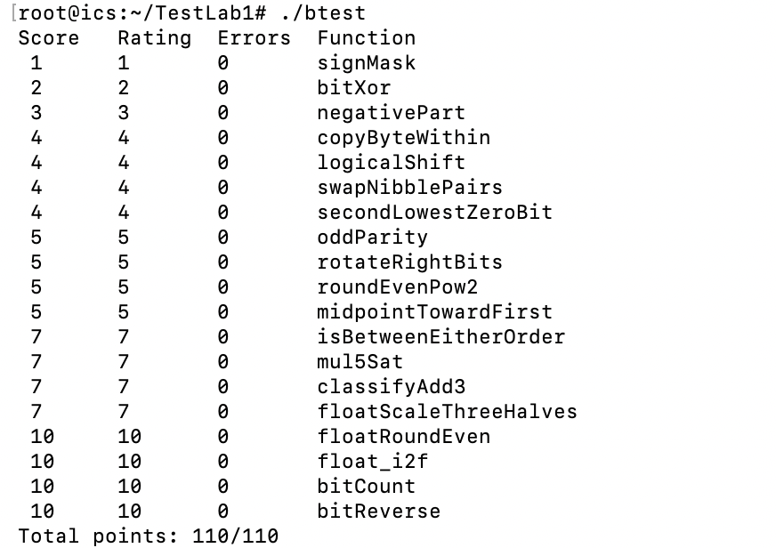

# 实验基本信息

1. 实验标题： Lab1: DataLab
2. 完成人信息：黄宇浩 25303090008

# 在终端中执行 `./check_ops.py bits.c` 后的截图 

# 在终端中执行 ./btest 后的截图 

# bits.c 中实现每个函数的思路描述

1. **signMask**：把 1 左移 31 位，这样只有最高位是 1，其他位都是 0。

2. **bitXor**：异或就是两个位不一样时结果为 1。根据这个特点，用 `~` 和 `&` 把异或的效果表示出来。

3. **negativePart**：先通过右移判断正负。负数就保留取反加一后的结果，非负数就返回 0。

4. **copyByteWithin**：先取出要复制的字节，再把目标位置清空，最后把取出的字节移过去并合进去。

5. **logicalShift**：先正常右移，再用掩码把左边因为符号扩展多出来的 1 去掉。

6. **swapNibblePairs**：把每个字节的高四位和低四位分开，分别往相反方向移动四位，再合起来。

7. **secondLowestZeroBit**：先把最低的那个 0 改成 1，再找剩下的最低的 0，它就是原来的第二个 0。

8. **oddParity**：不断右移并异或，把所有位的奇偶信息集中到最低位。如果要求偶数个 1 时返回 1，最后再把结果取反。

9. **rotateRightBits**：把右移时移出去的低位放到最左边，再和剩下右移后的部分合起来，就实现了循环右移。要注意移动 0 位的情况，避免出现移位 32 位。

10. **roundEvenPow2**：先看 x 除以 2 的幂后余下多少。超过一半就往上取，不到一半就往下取，刚好一半时选择商为偶数的那一边。

11. **midpointTowardFirst**：直接算两数之和可能溢出，所以用位运算来算平均值。如果中点不是整数，就取靠近第一个数 x 的那个整数。

12. **isBetweenEitherOrder**：分别比较 x 和两个端点的大小，判断它是不是夹在中间，同时把等于端点的情况也算进去。

13. **mul5Sat**：分步算出 2 倍、4 倍和 5 倍，并检查中间结果的符号有没有异常变化。如果溢出了，就根据原数的正负返回最大值或最小值。

14. **classifyAdd3**：把三个数相加拆成两次加法，分别记录有没有正溢出或负溢出，再综合判断最终的和是否超出范围。

15. **floatScaleThreeHalves**：先拆出浮点数的符号、指数和尾数，再用整数运算实现乘 1.5。过程中处理好舍入，以及非规格化数、无穷大和 NaN 等特殊情况。

16. **floatRoundEven**：根据指数找到整数和小数的分界，再看小数部分要不要进位。如果小数刚好是 0.5，就舍入到相邻的偶数。

17. **float_i2f**：先确定符号，再找到绝对值中最高的 1，用它确定指数。剩下的位用来构造尾数，放不下的部分按最近偶数规则舍入。

18. **bitCount**：先数每两位中有几个 1，再把相邻的结果加起来，依次统计四位、八位等更大范围，最后得到总数。

19. **bitReverse**：先交换相邻的两位，再交换相邻的两位一组、四位一组、八位一组，最后交换高低十六位，就把所有位的顺序反过来了。

# 引用内容及参考资料

1. roundEvenPow2、isBetweenEitherOrder、classifyAdd3、floatScaleThreeHalves、bitReverse这几道题我自己想了很久没想出来，参考了AI，swapNibblePairs、oddParity、float_i2f是我自己有思路，但是频繁报错，于是让AI帮我修改代码

2. 在写到第十五题的时候淡忘了一些关于浮点数的知识，翻阅了《深入理解计算机系统》这本书的相关章节

# 一些感受

1. 对这些各种数的理解确实深刻了很多吧，但也的确耗了我不少时间，还有对如何在不直接控制的情况下让事物内部的信息表露出来，关于这一点我冥冥中也有了更深刻的理解

2. 最后那个题确实不像是给人做的